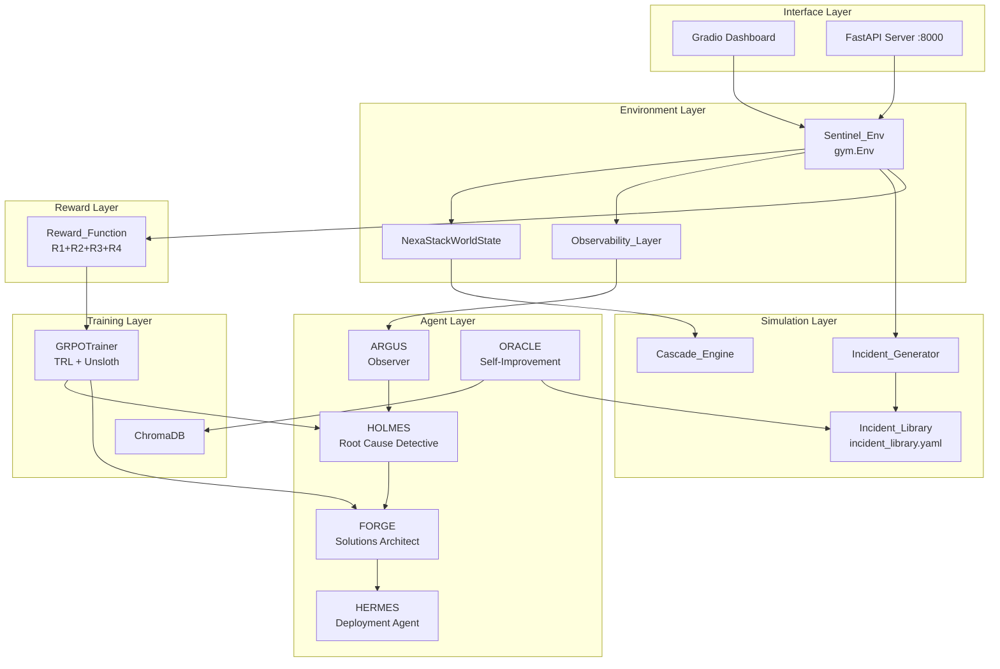
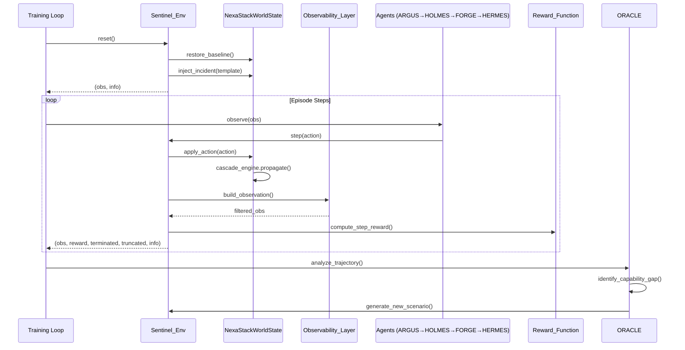

# Design Document

## SENTINEL: Multi-Agent Autonomous Incident Response RL Environment

---

## Overview

SENTINEL is a production-grade reinforcement learning training environment that simulates NexaStack — a 30-service e-commerce microservices platform — where five specialized AI agents cooperate to detect, diagnose, and remediate production incidents. The system implements the OpenEnv (gym.Env-compatible) interface, exposes an HTTP API via FastAPI, and trains HOLMES and FORGE agents using TRL GRPOTrainer with Unsloth-accelerated LoRA fine-tuning.

The design follows a layered architecture:

1. **Environment Layer** — `Sentinel_Env` (gym.Env subclass) + `NexaStackWorldState`
2. **Simulation Layer** — `Cascade_Engine`, `Observability_Layer`, `Incident_Library`
3. **Agent Layer** — ARGUS, HOLMES, FORGE, HERMES, ORACLE
4. **Reward Layer** — `Reward_Function` (4-dimensional RLVR)
5. **Training Layer** — GRPO pipeline with TRL + Unsloth
6. **Interface Layer** — FastAPI HTTP server + Gradio dashboard

### Key Design Decisions

- **RLVR over LLM-as-judge**: All reward signals are derived exclusively from `NexaStackWorldState` fields, ensuring reproducibility and eliminating judge bias.
- **Partial observability by design**: The `Observability_Layer` sits between the world state and agent observations, enforcing log suppression, black-box services, and red herring injection.
- **Hyperagent self-improvement**: ORACLE implements the Meta FAIR DGM-Hyperagent principle (arXiv:2603.19461) — the agent population's capability gaps drive the next training curriculum, stored and retrieved via ChromaDB.
- **Unsloth + LoRA for efficiency**: Unsloth provides 2–5× training throughput and up to 80% VRAM reduction, enabling Llama-3-8B fine-tuning on consumer hardware.
- **Separation of agent roles**: Each agent is constrained to a specific action category (investigative, remediation, deployment, meta) to enforce clean role boundaries and prevent reward hacking.

---

## Architecture



### Component Interaction Flow



---

## Components and Interfaces

### 2.1 Sentinel_Env

The top-level environment class implementing `gymnasium.Env`.

```python
class Sentinel_Env(gymnasium.Env):
    metadata = {"render_modes": ["human", "json"]}

    def __init__(self, config_path: str = "env_spec.yaml"):
        self.observation_space: gymnasium.spaces.Dict
        self.action_space: gymnasium.spaces.Dict
        self.world_state: NexaStackWorldState
        self.observability_layer: Observability_Layer
        self.incident_generator: Incident_Generator
        self.reward_function: Reward_Function
        self.current_episode: Episode | None
        self.step_count: int

    def reset(self, seed=None, options=None) -> tuple[dict, dict]: ...
    def step(self, action: dict) -> tuple[dict, float, bool, bool, dict]: ...
    def render(self) -> str | None: ...
    def close(self) -> None: ...
```

**Configuration** (`env_spec.yaml`):
```yaml
nexastack:
  topology: default  # or path to custom topology file
incident:
  difficulty_distribution:
    easy: 0.3
    medium: 0.4
    hard: 0.3
reward:
  weights:
    r1_root_cause: 0.35
    r2_mttr: 0.30
    r3_recovery_quality: 0.25
    r4_blast_radius: 0.10
observability:
  black_box_services: ["payment-vault", "fraud-detector"]
  alert_threshold_multiplier: 1.5
training:
  max_steps_per_episode: 200
  sla_breach_threshold_steps: 50
```

### 2.2 FastAPI Server

```python
# sentinel/api/server.py
app = FastAPI(title="SENTINEL OpenEnv API")

@app.post("/reset")   -> ResetResponse
@app.post("/step")    -> StepResponse      # raises HTTP 422 on malformed action
@app.get("/render")   -> RenderResponse
@app.post("/close")   -> CloseResponse
@app.get("/health")   -> HealthResponse
```

All request/response models are Pydantic v2 models. FastAPI's built-in `RequestValidationError` handler returns HTTP 422 with a structured error body for malformed action payloads.

### 2.3 NexaStackWorldState

```python
@dataclass
class ServiceMetrics:
    cpu: float          # 0.0–1.0
    memory: float       # 0.0–1.0
    latency_ms: float
    error_rate: float   # 0.0–1.0
    saturation: float   # 0.0–1.0
    availability: bool

@dataclass
class NexaStackWorldState:
    services: dict[str, ServiceMetrics]   # 30 services
    cdg: nx.DiGraph                        # Causal Dependency Graph
    incident_state: IncidentState | None
    step: int

    def snapshot(self) -> dict: ...        # JSON-serializable dict
    def restore_baseline(self) -> None: ...
    def apply_degradation(self, service: str, severity: float) -> None: ...
    def to_json(self) -> str: ...
    @classmethod
    def from_json(cls, data: str) -> "NexaStackWorldState": ...
```

**NexaStack Service Topology** (30 services across 4 layers):

| Layer | Count | Services |
|---|---|---|
| Frontend | 3 | web-gateway, mobile-api, cdn-edge |
| Application | 12 | cart-service, order-service, product-catalog, search-service, recommendation-engine, user-auth, notification-service, pricing-engine, inventory-service, review-service, wishlist-service, session-manager |
| Data | 8 | postgres-primary, postgres-replica, redis-cache, elasticsearch, kafka-broker, object-storage, analytics-db, audit-log |
| Infrastructure | 7 | service-mesh, load-balancer, api-gateway, config-service, secret-manager, payment-vault, fraud-detector |

### 2.4 Cascade Engine

```python
class Cascade_Engine:
    MAX_DEPTH = 6
    SEVERITY_DECAY = 0.7

    def propagate_failure(
        self,
        world_state: NexaStackWorldState,
        root_service: str,
        failure_type: FailureType,
        initial_severity: float,
    ) -> dict[str, float]:  # service -> degradation_severity
        # BFS up to depth 6, severity *= 0.7 per hop
        ...

    def propagate_recovery(
        self,
        world_state: NexaStackWorldState,
        resolved_service: str,
    ) -> None: ...

    def get_blast_radius(self) -> set[str]: ...
```

Supported `FailureType` enum values: `memory_leak`, `connection_pool_exhaustion`, `cpu_spike`, `bad_deployment`, `cache_miss_storm`, `network_partition`.

### 2.5 Observability Layer

```python
class Observability_Layer:
    def __init__(self, config: ObservabilityConfig):
        self.black_box_services: set[str]
        self.log_suppression_ratio: float  # sampled once per episode from U[0.0, 0.8]
        self.red_herring_count: int        # sampled from {1, 2, 3}

    def build_observation(
        self,
        world_state: NexaStackWorldState,
        incident_state: IncidentState,
        hypothesis_tree: HypothesisTree,
    ) -> dict: ...

    def sample_episode_params(self) -> None:
        # Called at reset(); samples log_suppression_ratio and red_herring_count
        ...
```

### 2.6 Incident Library and Generator

```python
@dataclass
class IncidentTemplate:
    id: str                          # e.g. "E1", "M2", "H1"
    name: str
    difficulty: Literal["easy", "medium", "hard"]
    root_cause_service: str
    failure_type: FailureType
    ground_truth_signals: list[str]
    red_herring_signals: list[str]
    cascade_risk: Literal["low", "medium", "high"]
    missing_log_ratio: float
    expected_steps_to_resolve: tuple[int, int]  # (min, max)

class Incident_Generator:
    def sample(self, difficulty_distribution: dict[str, float]) -> IncidentTemplate: ...
    def validate_template(self, template: IncidentTemplate) -> bool: ...
    def add_template(self, template: IncidentTemplate) -> None: ...
```

### 2.7 Agent Interfaces

All agents share a common base interface:

```python
class BaseAgent(ABC):
    @abstractmethod
    def act(self, observation: dict) -> Action: ...

    @abstractmethod
    def reset(self) -> None: ...
```

**ARGUS** — polls world state, emits investigative + meta actions only.

**HOLMES** — maintains `HypothesisTree`, emits `FormHypothesis` + investigative actions. Fine-tuned via GRPOTrainer.

```python
@dataclass
class HypothesisNode:
    service: str
    failure_type: FailureType
    confidence: float   # Bayesian score 0.0–1.0
    children: list["HypothesisNode"]

class HypothesisTree:
    root: HypothesisNode | None
    def update_confidences(self, observation: dict) -> None: ...
    def get_primary_candidate(self, threshold: float = 0.85) -> HypothesisNode | None: ...
```

**FORGE** — receives `HypothesisTree` + world state snapshot, emits remediation actions only. Fine-tuned via GRPOTrainer.

**HERMES** — executes deployment actions with canary strategy, emits deployment + `CloseIncident` actions only.

**ORACLE** — analyzes trajectories, stores in ChromaDB, generates new incident templates.

### 2.8 Reward Function

```python
class Reward_Function:
    def __init__(self, weights: RewardWeights, sla_breach_threshold: int):
        self.w = weights  # r1=0.35, r2=0.30, r3=0.25, r4=0.10

    def compute_step_reward(
        self,
        action: Action,
        world_state: NexaStackWorldState,
        incident_state: IncidentState,
    ) -> float: ...

    def compute_episode_reward(
        self,
        trajectory: Trajectory,
        world_state: NexaStackWorldState,
        incident_state: IncidentState,
    ) -> RewardBreakdown: ...

    def _r1_root_cause_accuracy(self, ...) -> float: ...   # 0.0, 0.5, or 1.0
    def _r2_mttr(self, ...) -> float: ...                  # 0.0–1.1 (with bonus)
    def _r3_recovery_quality(self, ...) -> float: ...      # fraction of services recovered
    def _r4_blast_radius(self, ...) -> float: ...          # 1 - (final_br / peak_br)
```

### 2.9 Training Pipeline

```python
# sentinel/training/pipeline.py

def build_grpo_trainer(
    agent: Literal["holmes", "forge"],
    env: Sentinel_Env,
    config: TrainingConfig,
) -> GRPOTrainer:
    model, tokenizer = FastLanguageModel.from_pretrained(
        model_name="unsloth/Meta-Llama-3-8B-Instruct",
        max_seq_length=4096,
        load_in_4bit=True,
    )
    model = FastLanguageModel.get_peft_model(
        model,
        r=16,
        lora_alpha=32,
        target_modules=["q_proj", "k_proj", "v_proj", "o_proj",
                        "gate_proj", "up_proj", "down_proj"],
    )
    return GRPOTrainer(
        model=model,
        reward_funcs=[env.reward_function.compute_episode_reward],
        args=GRPOConfig(...),
    )
```

### 2.10 Gradio Dashboard

```python
# demo/app.py
import gradio as gr

def build_dashboard(env: Sentinel_Env) -> gr.Blocks:
    with gr.Blocks() as demo:
        # Health panel: 30-service color-coded grid
        # Agent action feed: last 20 actions per agent
        # Training chart: reward + MTTR + R1–R4 over last 50 episodes
        # Inject Incident control
        # ORACLE capability gap display
        ...
    return demo

demo = build_dashboard(env)
demo.launch()  # HuggingFace Spaces compatible
```

---

## Data Models

### Action Schema

```python
class Action(BaseModel):
    agent: Literal["argus", "holmes", "forge", "hermes", "oracle"]
    category: Literal["investigative", "remediation", "deployment", "meta"]
    name: str
    params: dict[str, Any]

# Investigative
QueryLogs(service: str, time_range: tuple[int, int])
QueryTrace(trace_id: str)
QueryMetrics(service: str, metric_name: str, time_range: tuple[int, int])
FormHypothesis(service: str, failure_type: str, confidence: float)

# Remediation
RestartService(service: str)
ScaleService(service: str, replicas: int)
ModifyConfig(service: str, key: str, value: str)
RollbackDeployment(service: str, version: str)
DrainTraffic(service: str)
ModifyRateLimit(service: str, limit_rps: int)

# Deployment
CanaryDeploy(service: str, version: str, traffic_percent: float)
FullDeploy(service: str, version: str)
Rollback(service: str)

# Meta
GenerateNewScenario(difficulty: str, target_gap: str)
EscalateToHuman(reason: str)
CloseIncident(resolution_summary: str)
```

### Observation Schema

```python
class Observation(TypedDict):
    metrics_snapshot: dict[str, ServiceMetrics | None]  # None for black-box
    causal_graph_snapshot: list[list[float]]             # 30×30 adjacency matrix
    active_alerts: list[Alert]                           # includes red herrings
    recent_logs: list[LogEntry]                          # post-suppression
    active_traces: list[Trace]
    incident_context: IncidentContext
    sla_state: dict[str, bool]                           # service -> compliant
```

### Trajectory Schema

```python
@dataclass
class TrajectoryStep:
    observation: dict
    action: Action
    reward: float
    terminated: bool
    truncated: bool
    info: dict

@dataclass
class Trajectory:
    episode_id: str
    incident_template_id: str
    steps: list[TrajectoryStep]
    final_reward: RewardBreakdown
    mttr: int

    def to_json(self) -> str: ...
    @classmethod
    def from_json(cls, data: str) -> "Trajectory": ...
```

### IncidentState Schema

```python
@dataclass
class IncidentState:
    template_id: str
    root_cause_service: str
    failure_type: FailureType
    ground_truth_signals: list[str]
    red_herring_signals: list[str]
    affected_services: dict[str, float]   # service -> severity
    peak_blast_radius: set[str]
    current_blast_radius: set[str]
    timeline: list[TimelineEntry]
    attempted_remediations: list[Action]
    active_hypotheses: list[HypothesisNode]
    resolved: bool
    step_injected: int
```

### RewardBreakdown Schema

```python
@dataclass
class RewardBreakdown:
    r1: float   # root cause accuracy
    r2: float   # MTTR score
    r3: float   # recovery quality
    r4: float   # blast radius minimization
    penalties: float
    total: float
```

---

## Correctness Properties

*A property is a characteristic or behavior that should hold true across all valid executions of a system — essentially, a formal statement about what the system should do. Properties serve as the bridge between human-readable specifications and machine-verifiable correctness guarantees.*


### Property 1: reset() returns a structurally valid observation

*For any* call to `reset()`, the returned observation must be a dictionary containing all required keys (`metrics_snapshot`, `causal_graph_snapshot`, `active_alerts`, `recent_logs`, `active_traces`, `incident_context`, `sla_state`), the info must be a dict, and `incident_state` must be non-None (an incident was sampled).

**Validates: Requirements 1.2, 6.1**

---

### Property 2: step() returns a valid Gymnasium 5-tuple

*For any* valid action submitted to `step()`, the return value must be a 5-tuple `(observation, reward, terminated, truncated, info)` where observation is a dict, reward is a float, terminated and truncated are booleans, and info is a dict.

**Validates: Requirements 1.3**

---

### Property 3: Malformed action payloads return HTTP 422

*For any* malformed action payload sent to the `/step` endpoint (missing required fields, wrong types, invalid enum values), the FastAPI server must return an HTTP 422 response with a structured validation error body.

**Validates: Requirements 1.6**

---

### Property 4: World state always contains exactly 30 services with valid metrics

*For any* sequence of actions applied to the environment, the `NexaStackWorldState` must always contain exactly 30 services, each with a complete `ServiceMetrics` object where all numeric fields are finite floats and `availability` is a boolean.

**Validates: Requirements 2.1**

---

### Property 5: CDG edge weights are always in [0.0, 1.0]

*For any* `NexaStackWorldState` snapshot, every edge weight in the Causal Dependency Graph must be a float in the closed interval [0.0, 1.0].

**Validates: Requirements 2.3**

---

### Property 6: Metric threshold crossing updates availability

*For any* service and any metric value that crosses the degradation threshold, the service's `availability` field in `NexaStackWorldState` must be updated to `False` to reflect the degraded state.

**Validates: Requirements 2.4**

---

### Property 7: reset() restores all services to baseline

*For any* episode (regardless of which incident was injected or which actions were taken), calling `reset()` must restore all 30 services to their baseline healthy metric values, with all metrics equal to their pre-episode baseline values.

**Validates: Requirements 2.6**

---

### Property 8: Log suppression ratio is in [0.0, 0.8] and constant within an episode

*For any* episode, the log suppression ratio sampled at `reset()` must be in [0.0, 0.8], and that same ratio must be applied consistently to every observation constructed during that episode (it must not change between steps).

**Validates: Requirements 3.1, 3.5**

---

### Property 9: Active incidents always have 1–3 red herring alerts

*For any* observation constructed while an incident is active, the `active_alerts` field must contain between 1 and 3 alerts that are red herrings (injected spurious signals), in addition to any true alerts.

**Validates: Requirements 3.3**

---

### Property 10: CDG snapshot zeros out black-box service rows

*For any* observation, the `causal_graph_snapshot` 30×30 matrix must have all entries in the rows corresponding to black-box services set to 0.0.

**Validates: Requirements 3.4**

---

### Property 11: Cascade propagation respects BFS depth ≤ 6 with exponential severity decay

*For any* CDG topology and any root failure injection, the Cascade_Engine must satisfy two invariants simultaneously: (a) no affected service is reachable at BFS depth greater than 6 from the root service, and (b) the degradation severity assigned to a service at depth d equals `initial_severity × (0.7^d)`.

**Validates: Requirements 4.1, 4.2**

---

### Property 12: Recovery propagates through the same paths as failure

*For any* cascade failure, after the root cause service is resolved, the Cascade_Engine must propagate recovery signals through the same dependency paths that were used during failure propagation, restoring affected services.

**Validates: Requirements 4.4**

---

### Property 13: Every incident template contains all required fields

*For any* incident template in the Incident_Library (including ORACLE-generated ones), the template must contain all required fields: `root_cause_service`, `failure_type`, `ground_truth_signals`, `red_herring_signals`, `cascade_risk`, `missing_log_ratio`, and `expected_steps_to_resolve`.

**Validates: Requirements 5.2, 5.5**

---

### Property 14: Incident sampling matches the configured difficulty distribution

*For any* difficulty distribution configuration, sampling a large number of incidents from the Incident_Generator must produce a distribution of difficulty tiers that matches the configured probabilities within statistical tolerance (±5% for n ≥ 1000 samples).

**Validates: Requirements 5.4**

---

### Property 15: Red herring alerts are not labeled in observations

*For any* observation during an active incident, no alert in the `active_alerts` field may contain a field or marker that distinguishes it as a red herring — all alerts must appear structurally identical to true alerts.

**Validates: Requirements 6.4**

---

### Property 16: RestartService on a healthy service incurs a blast_radius penalty

*For any* healthy service (all metrics within baseline bounds), submitting a `RestartService` action must result in a negative reward contribution (blast_radius penalty) in the step reward.

**Validates: Requirements 7.6**

---

### Property 17: Episode reward equals the weighted sum of components plus penalties

*For any* completed episode, the `total` field of `RewardBreakdown` must equal `0.35 × R1 + 0.30 × R2 + 0.25 × R3 + 0.10 × R4 + penalties`, where R1 ∈ {0.0, 0.5, 1.0}, R2 ∈ [0.0, 1.1], R3 ∈ [0.0, 1.0], and R4 ∈ [0.0, 1.0].

**Validates: Requirements 13.1, 13.2, 13.3, 13.4, 13.5**

---

### Property 18: Blast radius expansion triggers a -1.0 penalty

*For any* remediation action that causes the current `Blast_Radius` to expand beyond its value at the time the action was submitted, the step reward must include a hard penalty of exactly -1.0.

**Validates: Requirements 13.6**

---

### Property 19: Late resolution triggers a -0.5 penalty

*For any* episode where the incident resolution time exceeds 2× the SLA breach threshold for any affected service, the episode reward must include a hard penalty of exactly -0.5.

**Validates: Requirements 13.7**

---

### Property 20: NexaStackWorldState serialization round-trip

*For any* valid `NexaStackWorldState` object, calling `to_json()` followed by `from_json()` must produce an object with identical `ServiceMetrics` values for all 30 services, identical CDG edge weights, and identical `IncidentState` fields.

**Validates: Requirements 18.1, 18.2**

---

### Property 21: Trajectory serialization round-trip

*For any* valid `Trajectory` object, calling `to_json()` followed by `from_json()` must produce a `Trajectory` with identical observation dictionaries, identical action parameters, and identical reward values for every step.

**Validates: Requirements 18.3, 18.4**

---

### Property 22: Incident template YAML round-trip

*For any* incident template parsed from `incident_library.yaml`, serializing it back to YAML and re-parsing must produce an equivalent template with all fields identical to the original.

**Validates: Requirements 18.5**

---

## Error Handling

### Environment Errors

| Error Condition | Handling Strategy |
|---|---|
| `step()` called before `reset()` | Raise `gymnasium.error.ResetNeeded` |
| Action references non-existent service | Return step with `reward=-0.1`, `info.error="unknown_service"` |
| Action submitted by wrong agent role | Return step with `reward=-0.1`, `info.error="role_violation"` |
| `incident_library.yaml` missing or malformed | Raise `IncidentLibraryError` at env init time |
| `env_spec.yaml` missing | Fall back to default configuration with a warning log |
| CDG becomes disconnected during cascade | Log warning, continue with partial graph |

### FastAPI Server Errors

| HTTP Status | Condition |
|---|---|
| 422 Unprocessable Entity | Malformed action payload (Pydantic validation failure) |
| 503 Service Unavailable | Sentinel_Env not initialized (before first `/reset`) |
| 500 Internal Server Error | Unhandled exception in env step; returns traceback in debug mode |

### Training Pipeline Errors

| Error Condition | Handling Strategy |
|---|---|
| CUDA OOM during GRPO update | Reduce batch size by half and retry; log warning |
| ChromaDB connection failure | ORACLE falls back to in-memory trajectory storage for the episode |
| Checkpoint file corrupted | Log error and start from last valid checkpoint; do not crash |
| ORACLE-generated template fails schema validation | Discard template, log warning, continue training |

### Cascade Engine Errors

| Error Condition | Handling Strategy |
|---|---|
| Root service not in CDG | Raise `CascadeError` with descriptive message |
| Circular dependency detected | BFS naturally handles cycles via visited set |
| Severity exceeds 1.0 after accumulation | Clamp to 1.0 |

---

## Testing Strategy

### Overview

SENTINEL uses a dual testing approach: property-based tests for universal invariants and example-based unit/integration tests for specific behaviors. The property-based testing library is **Hypothesis** (Python), configured with a minimum of 100 examples per property.

### Property-Based Tests

Each correctness property (Properties 1–22) is implemented as a single Hypothesis property test. Tests are tagged with the feature and property number for traceability.

```python
# Example property test structure
from hypothesis import given, settings
from hypothesis import strategies as st

# Feature: sentinel, Property 20: NexaStackWorldState serialization round-trip
@given(world_state=st.from_type(NexaStackWorldState))
@settings(max_examples=100)
def test_world_state_round_trip(world_state):
    serialized = world_state.to_json()
    restored = NexaStackWorldState.from_json(serialized)
    assert_world_states_equal(world_state, restored)
```

**Property test configuration:**
- Library: `hypothesis` (pip install hypothesis)
- Minimum iterations: 100 per property
- Tag format: `# Feature: sentinel, Property {N}: {property_text}`
- Custom strategies for: `NexaStackWorldState`, `Trajectory`, `IncidentTemplate`, `Action`, `CDG`

### Unit Tests

Unit tests cover specific examples, edge cases, and integration points:

- **Cascade Engine**: specific BFS traversal examples, depth-6 boundary, severity decay at each depth
- **Reward Function**: exact R1/R2/R3/R4 values for known inputs, penalty application
- **Observability Layer**: black-box service masking, red herring injection count boundaries
- **Incident Generator**: schema validation rejection of invalid templates
- **HERMES canary logic**: rollback trigger on error_rate threshold breach
- **ORACLE retirement**: library pruning when > 50 ORACLE-generated templates

### Integration Tests

Integration tests verify end-to-end wiring:

- FastAPI `/reset` → `/step` → `/close` full episode flow (3 examples)
- Docker Compose service startup and inter-service connectivity
- ChromaDB trajectory storage and retrieval
- GRPOTrainer checkpoint save and resume

### Evaluation Pipeline

The training pipeline includes a held-out evaluation suite:
- 10 episodes per difficulty tier (Easy, Medium, Hard) = 30 total
- Reports mean ± std of R1, R2, R3, R4, total reward, and MTTR
- Run after every N training episodes (configurable)

### Test File Structure

```
tests/
  unit/
    test_cascade_engine.py
    test_reward_function.py
    test_observability_layer.py
    test_incident_generator.py
    test_hermes_canary.py
    test_oracle_retirement.py
  property/
    test_env_properties.py        # Properties 1–3, 7
    test_world_state_properties.py # Properties 4–6, 20
    test_observability_properties.py # Properties 8–10, 15
    test_cascade_properties.py    # Properties 11–12
    test_incident_properties.py   # Properties 13–14, 22
    test_action_properties.py     # Properties 16
    test_reward_properties.py     # Properties 17–19
    test_serialization_properties.py # Properties 20–22
    test_api_properties.py        # Property 3
  integration/
    test_fastapi_server.py
    test_docker_compose.py
    test_chromadb.py
    test_training_checkpoint.py
```
