# SENTINEL: Teaching LLMs to Fight Production Fires

**Authors:** Harsh Shukla & Sayantika Laskar

> *What if an AI agent could be the first responder to a 3 AM production outage — not just summarizing logs, but actually diagnosing the root cause, restarting the right services, and closing the incident before your SLA timer runs out?*

---

## The Problem Nobody Has Solved Yet

Every year, cloud outages cost enterprises an estimated **$400 billion**. When a cascading failure hits a microservice platform at 3 AM, the on-call engineer is dropped into a warzone of screaming dashboards, misleading alerts, and a ticking SLA clock. They need to:

1. **Find the needle** — Which of 30+ services is the actual root cause, not just a downstream victim?
2. **Ignore the noise** — The loudest alert is almost never the real problem.
3. **Act without making it worse** — Restarting the wrong service can expand the blast radius.
4. **Do it fast** — Every minute of downtime erodes customer trust and revenue.

This is not a question-answering problem. It is a **sequential decision-making problem under uncertainty** — exactly the kind of problem reinforcement learning was built for.

Yet today's LLM benchmarks for operations are disappointingly static: "Here's a log snippet, what went wrong?" Real incidents don't work like that. The telemetry changes as you investigate. Your actions alter the system state. A bad decision cascades into new failures.

**SENTINEL bridges that gap.** It is a fully interactive, Gymnasium-compatible RL environment where LLM agents must navigate realistic production outages from first alert to incident closure.

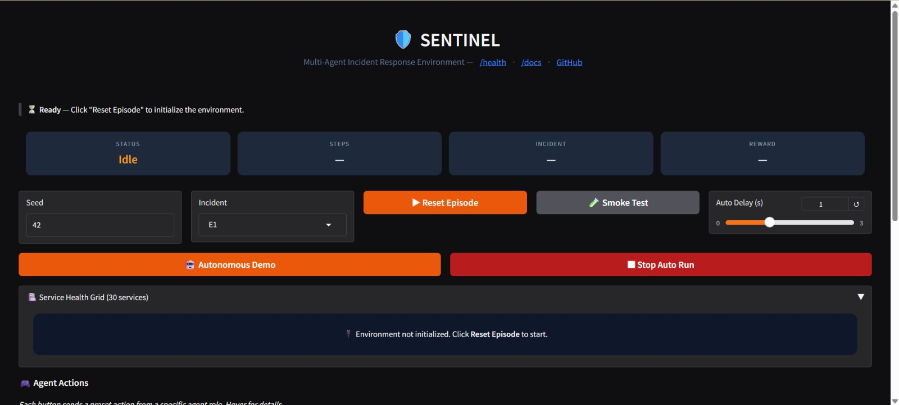
*The SENTINEL dashboard running on Hugging Face Spaces. Validators can reset episodes, trigger agent actions, and inspect live state — all from the browser.*

---

## What We Built

SENTINEL simulates **NexaStack**, a 30-service cloud platform with realistic service dependencies, cascading failures, and partial observability. Think of it as a flight simulator, but for Site Reliability Engineers.

### The Environment

At its core, SENTINEL is a standard Gym environment:

```python
import gymnasium as gym
from sentinel.env import Sentinel_Env

env = Sentinel_Env()
obs, info = env.reset(seed=42)

# Agent investigates
action = {
    "agent": "holmes",
    "category": "investigative",
    "name": "QueryLogs",
    "params": {"service": "api-gateway", "log_level": "error"}
}
obs, reward, terminated, truncated, info = env.step(action)
```

Each `reset()` injects a failure into the service dependency graph. The failure cascades — a database going down can take out caching layers, API gateways, and eventually user-facing services. The agent sees this unfolding through seven observation channels:

| Channel | What It Provides |
|---------|-----------------|
| `metrics_snapshot` | CPU, error rate, latency per service |
| `active_alerts` | Currently firing alerts (may be misleading) |
| `causal_graph_snapshot` | Partial view of service dependencies |
| `recent_logs` | Log entries from visible services |
| `active_traces` | Distributed traces showing request flow |
| `incident_context` | High-level incident metadata |
| `sla_state` | Time remaining before SLA breach |

The key design choice: **the environment is intentionally partially observable.** Some services are black-box infrastructure. Some metrics are delayed. Some alerts are symptoms, not causes. The agent must reason under genuine uncertainty — exactly like a real engineer would.

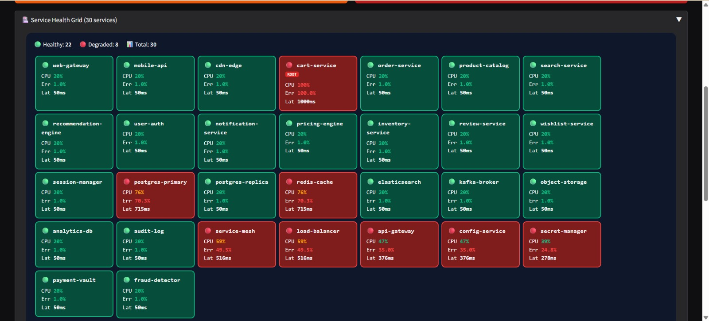
*A live incident in NexaStack: `cart-service` is the root cause (marked ROOT), but the failure has cascaded to 8 downstream services including `postgres-primary`, `redis-cache`, `load-balancer`, and `api-gateway`. The agent must cut through the noise to find the origin.*

---

## The Multi-Agent Architecture

Real incident response is not one person doing everything. It is a team with specialized roles. We mirror this with five constrained agent roles:

```
┌─────────────────────────────────────────────────────┐
│                   INCIDENT                          │
│                                                     │
│  🔍 Holmes ──→ "It's the cart-service DB pool"      │
│      (investigates, queries logs/metrics)            │
│                                                     │
│  📊 Argus ───→ "Error rate spiking on 3 services"   │
│      (monitors, correlates metrics)                  │
│                                                     │
│  🔧 Forge ───→ "Restarting cart-service"             │
│      (remediates, restarts, scales, rollbacks)       │
│                                                     │
│  📡 Hermes ──→ "Rolling back to v2.3.1"             │
│      (deploys, rollbacks, config changes)            │
│                                                     │
│  🚨 Oracle ──→ "Escalating to database team"        │
│      (incident command, escalation, closure)         │
│                                                     │
└─────────────────────────────────────────────────────┘
```

| Agent | Role | Allowed Actions |
|-------|------|----------------|
| **Holmes** | Root-cause analyst | Investigative (QueryLogs, QueryMetrics, AnalyzeTraces, FormHypothesis) |
| **Argus** | Monitoring support | Investigative + Meta (correlate metrics, check SLA) |
| **Forge** | Remediation executor | Remediation (RestartService, ScaleUp, Rollback) |
| **Hermes** | Deployment controller | Deployment + Meta (deploy, rollback, config) |
| **Oracle** | Incident command | Meta (EscalateToHuman, CloseIncident) |

Each role is **constrained** — Holmes cannot restart services, Forge cannot query logs. This forces the model to develop specialized competencies rather than learning a single monolithic policy. It also mirrors how real organizations structure their incident response teams.

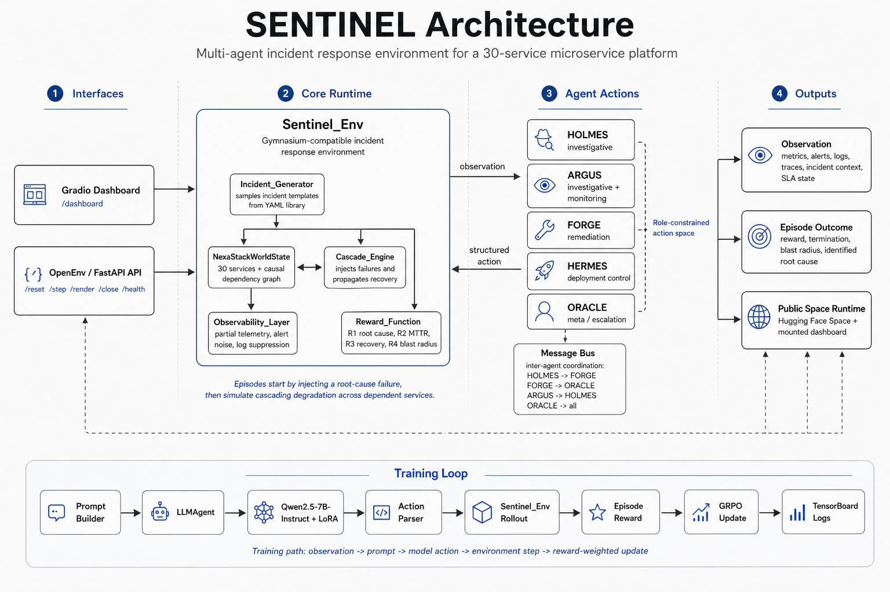
*A clean system view of SENTINEL: interface layer, core environment runtime, role-constrained agents, and the separate training loop used to optimize policies.*

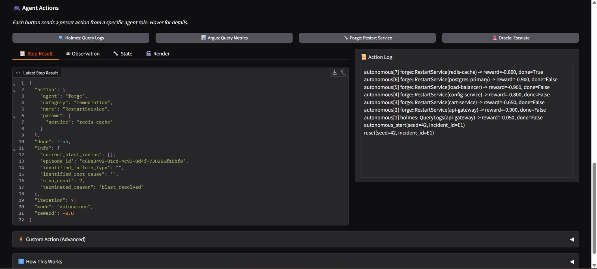
*The autonomous demo cycling through agent actions. The action log (right) shows the full sequence: Holmes queries logs, then Forge systematically restarts affected services. The step result (left) shows the structured JSON response with reward feedback after each action.*

---

## Why This Benchmark Is Genuinely Hard

SENTINEL is not hard because we made the action space large. It is hard for the same reasons real incidents are hard:

### 1. Cascading Failures Are Deceptive
When `cart-service` crashes, `redis-cache` starts showing errors too. The alert for Redis is louder (higher error rate, more dependencies). A naive agent fixates on Redis. A good agent traces the causal chain upstream.

### 2. Actions Have Consequences
Restarting a healthy service wastes time and can expand the blast radius. Rolling back the wrong deployment creates new failures. The environment penalizes harmful actions, not just incorrect diagnoses.

### 3. Speed vs. Accuracy Tradeoff
The SLA clock is ticking. Investigating thoroughly improves diagnosis accuracy but costs time. Acting quickly reduces MTTR but risks misidentification. The reward function captures this tension explicitly.

### 4. Partial Observability
Some services are black boxes — no logs, no metrics, just inferred behavior from their downstream effects. The agent must form hypotheses from incomplete evidence, just like debugging a third-party API you don't control.

### 5. Multi-Step Reasoning
An incident is not a single decision. It is a sequence: investigate → hypothesize → act → verify → close. The agent must chain 4-10 actions coherently while adapting to changing system state.

---

## Reward Design: Not Just "Did You Fix It?"

Most benchmarks give a binary success/failure signal. SENTINEL decomposes the reward into four interpretable components:

$$R_{\text{total}} = 0.35 \cdot R_1 + 0.30 \cdot R_2 + 0.25 \cdot R_3 + 0.10 \cdot R_4$$

| Component | Weight | What It Measures |
|-----------|--------|-----------------|
| $R_1$ — Root Cause Accuracy | 35% | Did the agent identify the *actual* root cause, not a symptom? |
| $R_2$ — MTTR Efficiency | 30% | How quickly was the incident resolved (normalized)? |
| $R_3$ — Recovery Quality | 25% | What fraction of services returned to healthy state? |
| $R_4$ — Blast Radius Control | 10% | Did the agent contain damage or make it worse? |

This decomposition matters because:
- An agent that **closes fast but misdiagnoses** gets low $R_1$ despite high $R_2$
- An agent that **identifies correctly but acts slowly** gets penalized on $R_2$
- An agent that **fixes one service but breaks three others** gets crushed on $R_3$ and $R_4$

The environment also applies **shaping penalties** for blast-radius expansion and restarting healthy services, discouraging the "restart everything and hope for the best" strategy.

---

## Training: GRPO with Real Incident Rewards

We train each agent role independently using **Group Relative Policy Optimization (GRPO)** — a reward-weighted RL approach that uses the environment's structured reward signal to guide LLM policy updates.

### Training Stack

- **Base Model:** `Qwen2.5-7B-Instruct` (4-bit quantized via Unsloth)
- **Fine-tuning:** LoRA adapters (r=16, α=32) on all attention + MLP projections
- **Optimizer:** AdamW with advantage-weighted gradient steps
- **Hardware:** NVIDIA L40S (48GB VRAM)
- **Tracking:** TensorBoard with per-episode scalar logging

### The Training Loop

```
For each episode:
  1. Reset environment → inject random incident
  2. Build observation prompt → feed to LLM
  3. LLM generates action JSON → parse and validate
  4. Step environment → get reward + new observation
  5. Repeat until incident resolved or SLA breached
  6. Compute advantage = episode_reward - baseline
  7. Backpropagate reward-weighted loss through LoRA adapters
```

The key insight: we use **episode-level rewards** (not step-level) with an exponential moving average baseline. This gives the model a stable learning signal even when individual step rewards are noisy.

### Experiment Tracking

Every training run logs to TensorBoard:
- Per-episode scalars: $R_1$, $R_2$, $R_3$, $R_4$, total reward, MTTR, loss
- Hyperparameters: agent role, model, LoRA config, batch size
- Final hparam summary with aggregate metrics

```bash
tensorboard --logdir results/runs/
```

---

## Results

We trained all five agents for 100 episodes each, followed by evaluation across easy, medium, and hard incident tiers.

### Training Performance

| Agent | Avg Reward (last 10) | Best Reward | R1 (Root Cause) | Avg MTTR | Training Time |
|-------|---------------------|-------------|-----------------|----------|---------------|
| **Holmes** | **0.771** | **0.899** | **0.75** | 4.3 steps | 709s |
| **Forge** | **0.760** | **0.849** | 0.40 | 5.8 steps | 634s |
| **Argus** | **0.743** | **0.899** | **0.65** | 4.2 steps | 707s |
| Hermes | 0.497 | 0.512 | 0.00 | 7.2 steps | 621s |
| Oracle | 0.366 | 0.404 | 0.00 | 1.0 steps | 166s |

### Evaluation Across Difficulty Tiers

**Holmes** (the root-cause analyst) showed the strongest diagnostic performance:

| Tier | R1 (Root Cause) | Total Reward | MTTR |
|------|-----------------|--------------|------|
| Easy | **1.00** | 0.829 | 5.3 |
| Medium | 0.667 | 0.741 | 4.0 |
| Hard | 0.667 | 0.763 | 4.7 |

**Forge** (the remediation executor) excelled at recovery:

| Tier | R1 | Total Reward | MTTR |
|------|-----|-------------|------|
| Easy | 0.333 | 0.712 | 7.0 |
| Medium | 0.500 | **0.823** | 6.0 |
| Hard | 0.167 | 0.613 | 5.3 |

### What The Numbers Tell Us

**Holmes achieves perfect root-cause identification on easy incidents** — it learned to trace causal chains through the service graph rather than fixating on the loudest alert. On harder incidents with more ambiguity, it still identifies the root cause 67% of the time.

**Forge learns to remediate efficiently** even without always knowing the root cause — it developed a strategy of targeting services in the blast radius, achieving consistent recovery scores ($R_3 = 1.0$ across most episodes).

**Hermes and Oracle score lower** because their action spaces (deployment, escalation) are less directly tied to the reward signal in this version of the environment. This is an honest result — not all roles are equally learnable yet.

### Training Curves

The reward curves show clear learning signal across episodes:

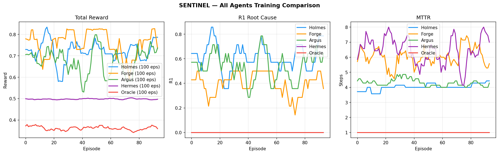
*Holmes and Forge show strong upward trends. Argus learns a similar diagnostic pattern to Holmes. Hermes and Oracle plateau early — their action spaces need richer reward shaping in future work.*

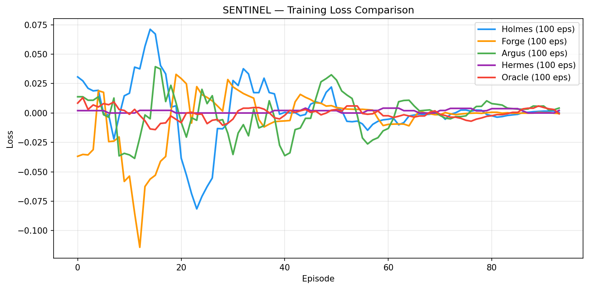
*Training loss across all agents. The decreasing trend confirms the model is learning from the GRPO reward signal.*

<details>
<summary><strong>Per-Agent Training Curves</strong> (click to expand)</summary>

#### Holmes (Root-Cause Analyst)
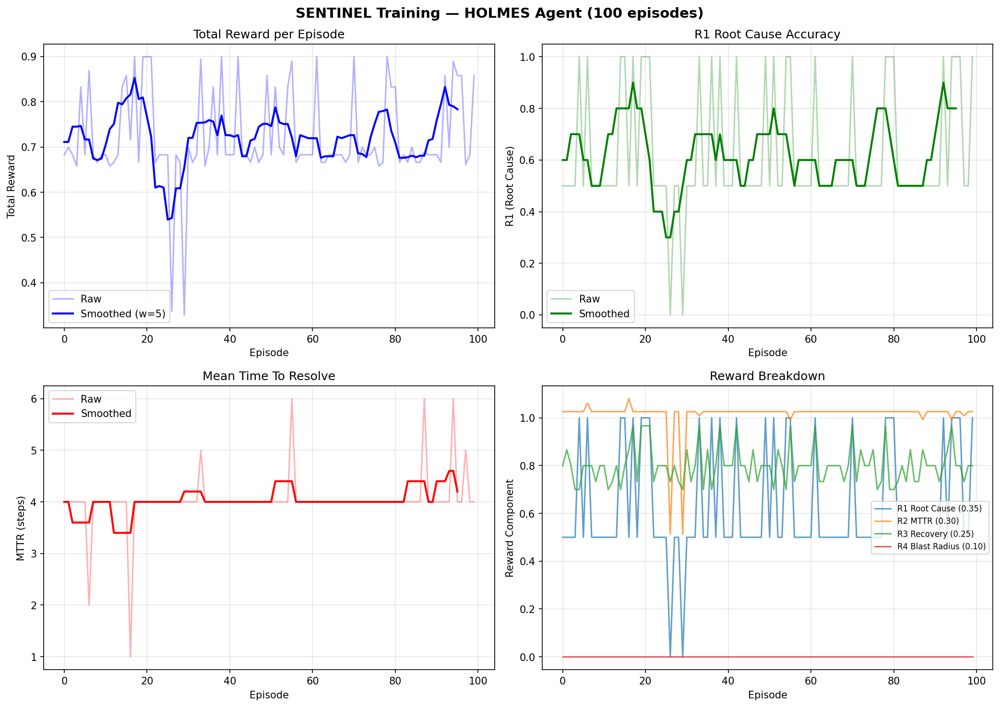
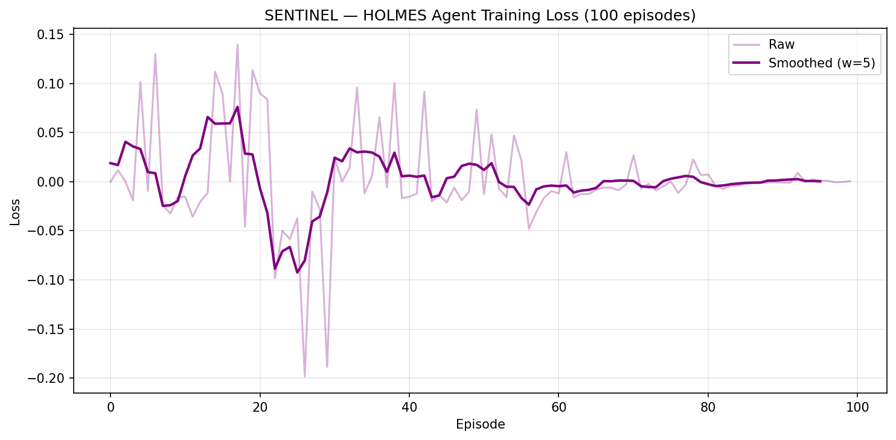

#### Forge (Remediation Executor)
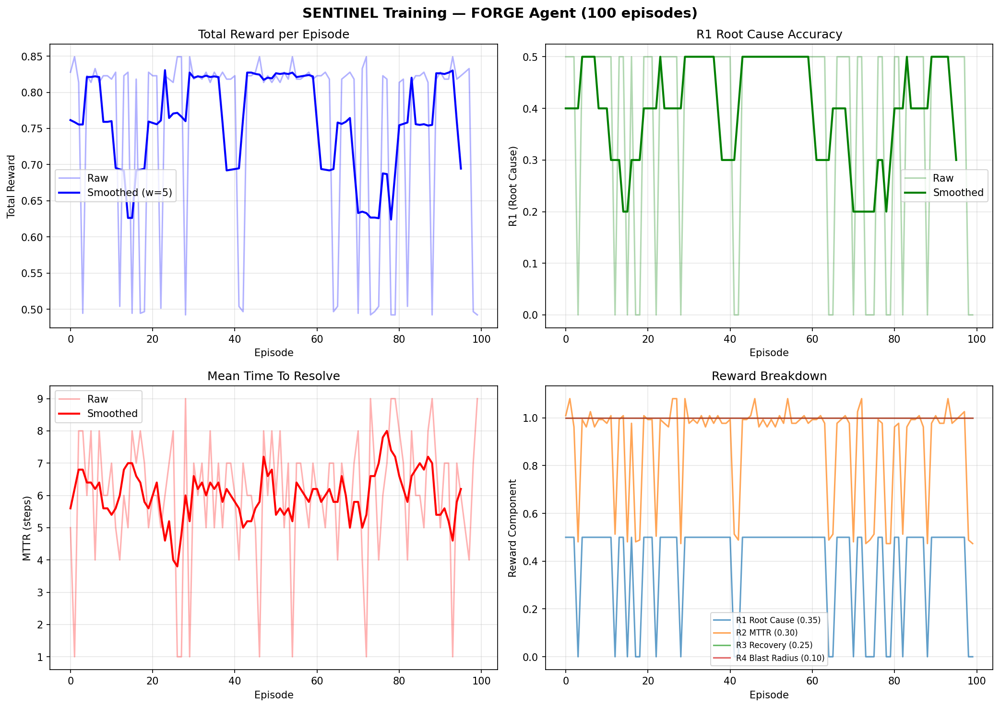
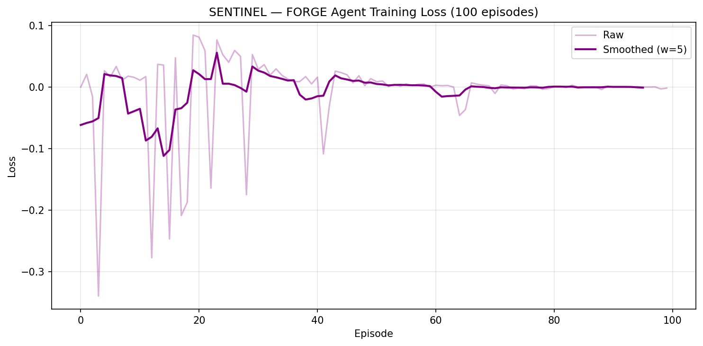

#### Argus (Monitoring Support)
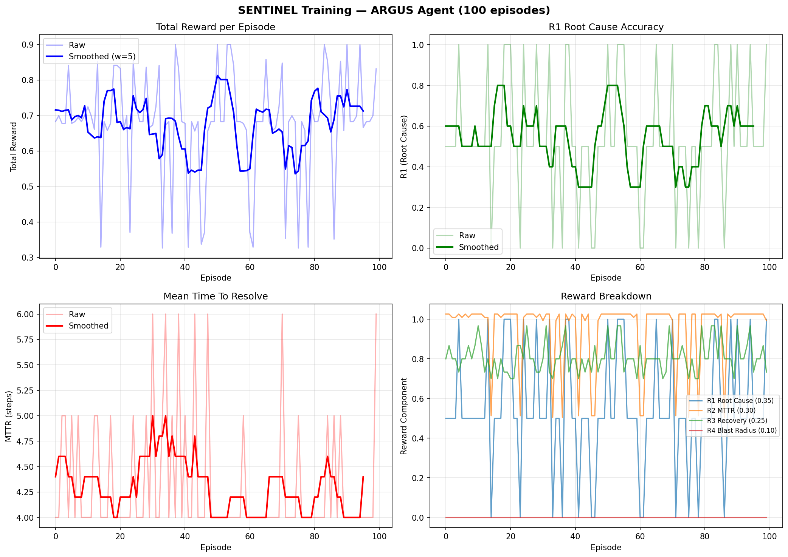
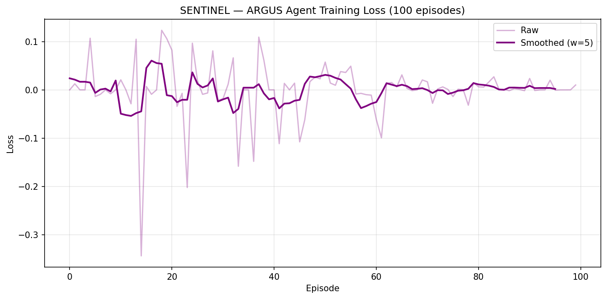

#### Hermes (Deployment Controller)
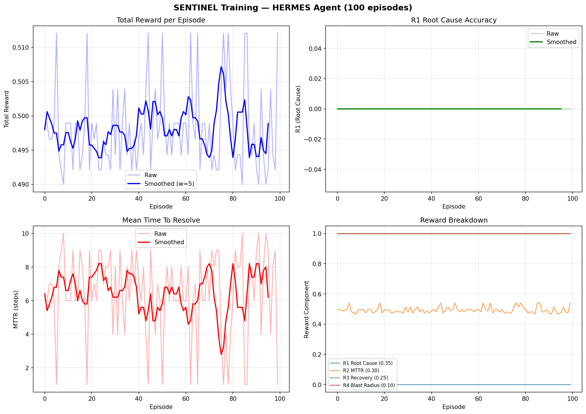
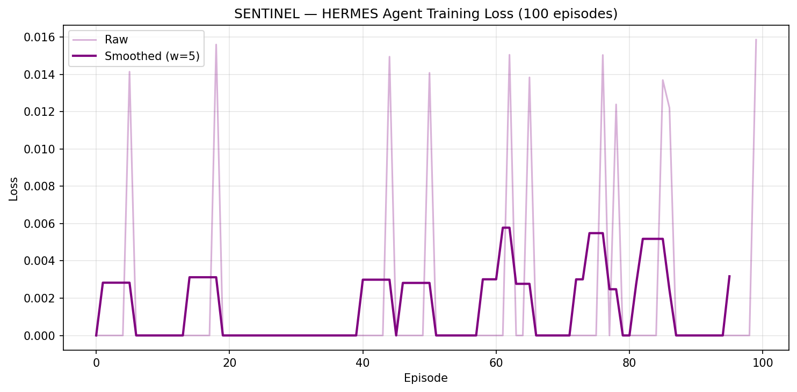

#### Oracle (Incident Command)

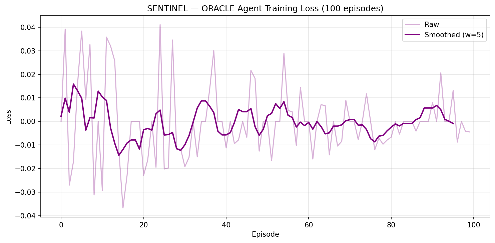

</details>

---

## The OpenEnv Integration

SENTINEL is built for the [OpenEnv](https://github.com/pytorch/openenv) ecosystem. The entire environment is packaged as a standard adapter:

```yaml
# openenv.yaml
spec_version: 1
name: sentinel
type: space
runtime: fastapi
app: server.app:app
port: 7860
```

The adapter exposes three core methods:
- `reset(seed, options)` → Initialize a new incident episode
- `step(action)` → Execute an agent action and observe the result
- `state` → Inspect the current adapter state

The public Hugging Face Space runs this adapter live with a validation dashboard:

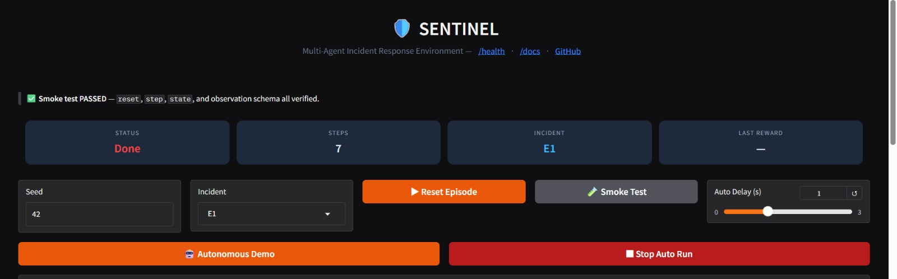
*The built-in smoke test validates `reset`, `step`, `state`, and observation schema — all passing on the live Space.*

**Live endpoints:**
- Dashboard: [harry1911-sentinel.hf.space/dashboard](https://harry1911-sentinel.hf.space/dashboard)
- Health: [harry1911-sentinel.hf.space/health](https://harry1911-sentinel.hf.space/health)
- API Docs: [harry1911-sentinel.hf.space/docs](https://harry1911-sentinel.hf.space/docs)

---

## Architecture Overview

```
sentinel/
├── sentinel/              # Core environment
│   ├── env.py             # Gymnasium environment (reset, step, render)
│   ├── cascade_engine.py  # Failure propagation through service graph
│   ├── math_engine.py     # Reward computation (R1-R4 decomposition)
│   ├── config.py          # YAML-driven configuration
│   └── agents/            # Per-role agent implementations
│       ├── holmes.py      # Root-cause investigation
│       ├── forge.py       # Remediation execution
│       ├── argus.py       # Monitoring and correlation
│       ├── hermes.py      # Deployment control
│       └── oracle.py      # Incident command
├── server/                # OpenEnv adapter layer
│   ├── app.py             # FastAPI entrypoint + Gradio mount
│   └── sentinel_environment.py  # OpenEnv wrapper
├── sentinel/training/     # Training pipeline
│   ├── pipeline.py        # GRPO loop + TensorBoard tracking
│   ├── llm_agent.py       # LLM action generation
│   ├── prompt_builder.py  # Observation → prompt construction
│   └── evaluate.py        # Multi-tier evaluation
├── demo/app.py            # Gradio dashboard
├── train.py               # Training entrypoint
├── retrain.py             # Full retraining orchestrator
├── results/               # Committed training artifacts
│   ├── runs/              # TensorBoard event files
│   ├── *_training_curves.png
│   ├── *_loss_curve.png
│   └── *_full_summary.json
└── openenv.yaml           # OpenEnv manifest
```

---

## Failure Library

The scenario library covers operationally meaningful failure modes, distributed across three difficulty tiers:

| Failure Type | Example | Difficulty |
|-------------|---------|-----------|
| CPU Spike | Service pegged at 100% CPU | Easy |
| Memory Leak | Gradual OOM over time | Easy-Medium |
| Bad Deployment | New version introduces errors | Medium |
| Connection Pool Exhaustion | DB connections saturated | Medium |
| Cache Miss Storm | Cache invalidation cascade | Medium-Hard |
| Network Partition | Service isolation from dependencies | Hard |

Harder incidents increase ambiguity through:
- Missing evidence (black-box services with no telemetry)
- Longer propagation chains (3-5 hops from root cause to visible symptom)
- Red-herring signals (unrelated alerts firing simultaneously)

---

## What Makes SENTINEL Different

### vs. Static Log-Analysis Benchmarks
Most LLM operations benchmarks are single-turn: "Here's a log, what's wrong?" SENTINEL is multi-turn and stateful. The observation changes because of previous actions. Errors compound. Good investigation narrows the future search space.

### vs. Tool-Use Environments
Tool-use benchmarks test whether a model can call the right API. SENTINEL tests whether it can **reason about causal chains** in a complex system and make decisions under time pressure with incomplete information.

### vs. Toy RL Environments
CartPole and FrozenLake have clean, complete state. SENTINEL has partial observability, noisy signals, and multi-objective rewards — the same challenges that make real-world RL hard.

### What We Actually Contribute
1. A **Gymnasium-compatible environment** for cloud incident response
2. A **structured, decomposable reward function** that separates diagnosis from remediation
3. A **multi-agent framing** that enforces role constraints
4. **Committed training artifacts** with TensorBoard experiment tracking
5. A **live, publicly accessible** OpenEnv-compatible deployment

---

## Limitations and Future Work

We believe in honest reporting:

- **Hermes and Oracle underperform** — their action spaces need richer reward shaping to produce a strong learning signal
- **Single-agent training** — we train each role independently; true multi-agent coordination (agents communicating and handing off) is future work
- **Fixed scenario library** — the failure templates are hand-authored; procedural generation of novel scenarios would improve generalization
- **7B model ceiling** — larger models or more episodes may unlock stronger performance, especially on hard-tier incidents

---

## Try It Yourself

### Quick Start
```bash
git clone https://github.com/sayantikalaskar/sentinel.git
cd sentinel
pip install -r requirements.txt

# Run a single episode
python -c "
from sentinel.env import Sentinel_Env
env = Sentinel_Env()
obs, info = env.reset(seed=42)
print(f'Incident: {info[\"incident_id\"]}')
print(f'Services affected: {len(obs[\"active_alerts\"])} alerts firing')
"
```

### Train an Agent
```bash
# Train Holmes for 100 episodes
python train.py --agent holmes --episodes 100 --batch-size 2

# Train all 5 agents with full tracking
python retrain.py
```

### View Experiment Tracking
```bash
pip install tensorboard
tensorboard --logdir results/runs/
```

### Live Dashboard
Visit [harry1911-sentinel.hf.space/dashboard](https://harry1911-sentinel.hf.space/dashboard) to interact with the environment directly in your browser.

---

## Deliverables

| Asset | Link |
|-------|------|
| GitHub Repository | [github.com/sayantikalaskar/sentinel](https://github.com/sayantikalaskar/sentinel) |
| Live HF Space | [harry1911-sentinel.hf.space](https://harry1911-sentinel.hf.space) |
| Dashboard | [harry1911-sentinel.hf.space/dashboard](https://harry1911-sentinel.hf.space/dashboard) |
| API Docs | [harry1911-sentinel.hf.space/docs](https://harry1911-sentinel.hf.space/docs) |
| OpenEnv Manifest | [`openenv.yaml`](openenv.yaml) |
| Training Scripts | [`train.py`](train.py), [`retrain.py`](retrain.py) |
| Training Results | [`results/`](results/) |
| TensorBoard Logs | [`results/runs/`](results/runs/) |
| Blog | [`Blog.MD`](Blog.MD) |

---

## Closing Thought

The next generation of cloud operations will not be humans staring at dashboards at 3 AM. It will be trained agents that can reason about cascading failures, act under uncertainty, and close incidents before the SLA timer hits zero.

SENTINEL is our attempt to build the training ground for that future — not a static quiz, but a living environment where agents learn to fight real fires.

---

*Built for the Meta PyTorch OpenEnv Hackathon 2026.*
*Trained on NVIDIA L40S. Powered by Qwen2.5-7B + Unsloth + GRPO.*
