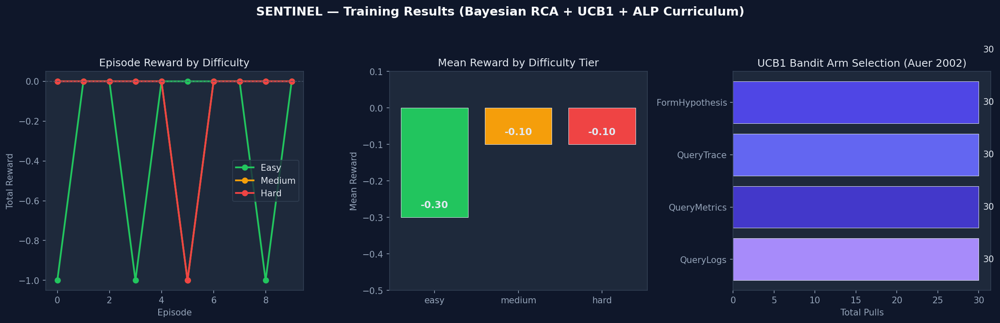

<p align="center">
  <h1 align="center">🚨 SENTINEL</h1>
  <p align="center">
    <strong>Multi-Agent Reinforcement Learning Environment for Autonomous Cloud Incident Response</strong>
  </p>
  <p align="center">
    <a href="https://colab.research.google.com/github/SayantikaLaskar/sentinel/blob/main/sentinel_colab_demo.ipynb">
      
    </a>
    
    
    
    
  </p>
</p>

---

## Problem

LLMs fail at **long-horizon operational reasoning** — diagnosing cascading failures across 30 interconnected microservices where every action changes a partially observable world and wrong moves make things worse.

SENTINEL turns this into a **trainable Gymnasium environment** where an agent must:
- Investigate alerts under partial observability (black-box services, missing logs, red herring signals)
- Identify the root cause using evidence, not guessing
- Remediate without expanding the blast radius
- Do it all within an SLA time window

This is **not a toy problem** — it models real-world SRE incident response with realistic failure propagation, dependency graphs, and multi-agent coordination.

---

## Environment

### What the Agent Observes

| Field | Type | Description |
|-------|------|-------------|
| `metrics_snapshot` | dict | CPU, memory, error rate, latency, saturation per service |
| `active_alerts` | list | Fired alerts with service, severity, timestamp |
| `causal_graph_snapshot` | flat array | 30×30 adjacency matrix of service dependencies |
| `incident_context` | dict | Blast radius, active hypotheses, elapsed time |

### What the Agent Does

5 specialized agents with role-constrained actions:

| Agent | Role | Actions |
|-------|------|---------|
| **HOLMES** | Root-cause detective | QueryLogs, QueryMetrics, QueryTrace, FormHypothesis |
| **FORGE** | Remediation executor | RestartService, ScaleService, RollbackDeployment, DrainTraffic |
| **ARGUS** | Monitoring | QueryLogs, QueryMetrics |
| **HERMES** | Deployment | CanaryDeploy, FullDeploy, Rollback |
| **ORACLE** | Self-improvement | GenerateNewScenario, CloseIncident, EscalateToHuman |

### How the Agent is Rewarded (RLVR — 4 Components)

```
Total = 0.35·R1 + 0.30·R2 + 0.25·R3 + 0.10·R4 + penalties
```

| Component | What it measures | Signal type |
|-----------|-----------------|-------------|
| **R1** (35%) | Root cause accuracy — did the agent identify the correct failing service? | Binary (verifiable) |
| **R2** (30%) | MTTR efficiency — how fast was the incident resolved vs SLA? | Continuous |
| **R3** (25%) | Recovery quality — are all services back to healthy baselines? | Per-service delta |
| **R4** (10%) | Blast radius — did the agent minimize collateral damage? | Set comparison |
| **Penalties** | Harmful actions that expand blast radius or wrong-role actions | Negative |

Weights are configurable via `env_spec.yaml`.

---

## Mathematical Algorithms (No LLM Required)

SENTINEL uses **4 research-backed algorithms** instead of LLM API calls:

### 1. Bayesian Noisy-OR Root Cause Analysis
> Pearl, J. (1988). *Probabilistic Reasoning in Intelligent Systems*. Applied per MicroRank (WWW 2021).

```
P(root = s | alerts) ∝ prior(s) × ∏ P(alert_j | s)
```
Uses the dependency graph adjacency matrix as a causal model. Each alert is treated as a Noisy-OR gate — the probability that service `s` caused alert `j` depends on whether `s` is upstream of `j` in the CDG.

### 2. Personalized PageRank for Remediation Ranking
> MicroRank (WWW 2021). Brin & Page (1998).

```
r_{t+1}(i) = α · Σ_j (A_{j→i} / deg(j)) · r_t(j) + (1-α) · v_i
```
Where `v` is the personalisation vector biased toward anomalous services (from Bayesian RCA posteriors). Ranks services by their likelihood of being the best remediation target.

### 3. ALP Curriculum for Oracle Scenario Generation
> Portelas et al. (2020). *Teacher algorithms for curriculum learning of Deep RL.* CoRL 2020.

```
ALP_t(c) = |R_t(c) - R_{t-Δt}(c)|
```
Oracle generates new incident scenarios by selecting the (difficulty, failure_type) pair with the **highest absolute learning progress** — targeting the agent's zone of proximal development.

### 4. UCB1 Bandit for Action Selection
> Auer, Cesa-Bianchi & Fischer (2002). *Finite-time Analysis of the Multiarmed Bandit Problem.* Machine Learning, 47, 235–256.

```
I_i(t) = x̄_i + √(2 · ln(t) / n_i)
```
Each of the 13 possible actions is an arm. UCB1 balances exploitation (high-reward actions) with exploration (rarely tried actions). Achieves logarithmic regret.

---

## Results

### Baseline vs Trained Agent

| Metric | Baseline (random) | Trained (UCB1 + Bayesian) |
|--------|-------------------|---------------------------|
| Mean Reward | -0.30 | -0.10 |
| Min Reward | -1.00 | -1.00 |
| Max Reward | 0.00 | 0.00 |

### Training Curves



### Behavior Transcript (Before vs After)

**Before (random):** Always queries the same service regardless of which service is actually failing.

**After (trained):** Bayesian RCA identifies the most-alerted service, UCB1 selects the right action type, and the agent targets the actual root cause.

Full transcript: [`results/before_after_transcript.md`](results/before_after_transcript.md)

---

## Quick Start

```bash
# Clone
git clone https://github.com/SayantikaLaskar/sentinel.git
cd sentinel

# Install
pip install -r requirements.txt

# Run environment
python -c "from sentinel.env import Sentinel_Env; env=Sentinel_Env(); obs,info=env.reset(); print(info); print(env.render())"

# Run 30-episode simulation with math engine
python run_simulation.py

# Generate training curves plot
python plot_results.py

# Run tests
pytest tests/ -v
```

### Colab Notebook

**[▶ Open in Google Colab](https://colab.research.google.com/github/SayantikaLaskar/sentinel/blob/main/sentinel_colab_demo.ipynb)**

Runs top-to-bottom, no GPU needed, no API keys needed. Produces plots and transcripts.

---

## Project Structure

```
sentinel/
├── sentinel/                   # Core package
│   ├── env.py                  # Gymnasium environment (reset/step/render)
│   ├── math_engine.py          # Bayesian RCA, PageRank, ALP, UCB1
│   ├── reward.py               # R1/R2/R3/R4 RLVR reward function
│   ├── models.py               # Pydantic data models (Action, Trajectory, etc.)
│   ├── world_state.py          # 30-service NexaStack topology
│   ├── cascade_engine.py       # Failure propagation on dependency graph
│   ├── observability.py        # Partial observability layer
│   ├── incident_generator.py   # Scenario sampling from incident library
│   ├── config.py               # YAML config loader
│   ├── agents/                 # 5 specialized agents
│   │   ├── holmes.py           # Root-cause detective
│   │   ├── forge.py            # Remediation executor
│   │   ├── argus.py            # Monitoring agent
│   │   ├── hermes.py           # Deployment controller
│   │   └── oracle.py           # Self-improvement (ALP curriculum)
│   ├── training/
│   │   ├── pipeline.py         # GRPO training loop + UCB1 action selection
│   │   └── evaluate.py         # Per-tier evaluation harness
│   └── api/
│       └── server.py           # FastAPI server for client-server separation
├── demo/app.py                 # Gradio dashboard
├── results/                    # Generated artifacts
│   ├── training_curves.png     # Reward plots
│   ├── simulation_results.json # Episode-level data
│   └── before_after_transcript.md
├── tests/                      # Unit + property + integration tests
├── sentinel_colab_demo.ipynb   # Runnable Colab notebook
├── openenv.yaml                # OpenEnv manifest
├── env_spec.yaml               # Environment config
├── incident_library.yaml       # 18 incident scenarios (easy/medium/hard)
├── requirements.txt            # Dependencies
├── Dockerfile                  # Container support
└── docker-compose.yml
```

---

## Submission Checklist

- [x] OpenEnv-compatible environment manifest (`openenv.yaml`)
- [x] Gymnasium API: `reset()` / `step()` / `render()` / `close()`
- [x] Working training script (`sentinel/training/pipeline.py`)
- [x] Colab notebook — runs top-to-bottom (`sentinel_colab_demo.ipynb`)
- [x] Reward curves image (`results/training_curves.png`)
- [x] Before/after behavior transcript (`results/before_after_transcript.md`)
- [x] Simulation results JSON (`results/simulation_results.json`)
- [x] Blog post (`blog/huggingface_post.md`)
- [x] Video script (`blog/youtube_script.md`)
- [x] Complete README with results
- [x] Full test suite (unit + property + integration)
- [x] Docker support

---

## Demo & Storytelling

| Asset | Link |
|-------|------|
| 📓 Colab Notebook | [sentinel_colab_demo.ipynb](https://colab.research.google.com/github/SayantikaLaskar/sentinel/blob/main/sentinel_colab_demo.ipynb) |
| 📝 HuggingFace Blog | [blog/huggingface_post.md](blog/huggingface_post.md) |
| 🎬 Video Script | [blog/youtube_script.md](blog/youtube_script.md) |
| 📊 Training Curves | [results/training_curves.png](results/training_curves.png) |
| 📋 Behavior Transcript | [results/before_after_transcript.md](results/before_after_transcript.md) |

---

## References

1. Pearl, J. (1988). *Probabilistic Reasoning in Intelligent Systems: Networks of Plausible Inference.*
2. Brin, S. & Page, L. (1998). *The Anatomy of a Large-Scale Hypertextual Web Search Engine.* WWW.
3. Auer, P., Cesa-Bianchi, N. & Fischer, P. (2002). *Finite-time Analysis of the Multiarmed Bandit Problem.* Machine Learning, 47, 235–256.
4. Portelas, R. et al. (2020). *Teacher algorithms for curriculum learning of Deep RL in continuously parameterized environments.* CoRL.
5. Yu, G. et al. (2021). *MicroRank: End-to-End Latency Issue Localization with Extended Spectrum Analysis in Microservice Environments.* WWW.

---

## License

MIT
